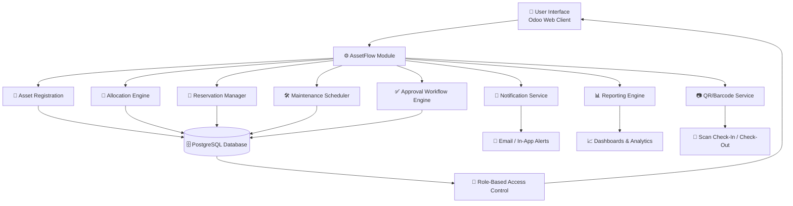

<div align="center">

```
 █████╗ ███████╗███████╗███████╗████████╗███████╗██╗      ██████╗ ██╗    ██╗
██╔══██╗██╔════╝██╔════╝██╔════╝╚══██╔══╝██╔════╝██║     ██╔═══██╗██║    ██║
███████║███████╗███████╗█████╗     ██║   █████╗  ██║     ██║   ██║██║ █╗ ██║
██╔══██║╚════██║╚════██║██╔══╝     ██║   ██╔══╝  ██║     ██║   ██║██║███╗██║
██║  ██║███████║███████║███████╗   ██║   ██║     ███████╗╚██████╔╝╚███╔███╔╝
╚═╝  ╚═╝╚══════╝╚══════╝╚══════╝   ╚═╝   ╚═╝     ╚══════╝ ╚═════╝  ╚══╝╚══╝ 
```

# 🏢 AssetFlow

### Enterprise Asset & Resource Management System

**Built for Odoo Hackathon 2026** 🚀

[](https://www.odoo.com/)
[](https://www.python.org/)
[](https://www.postgresql.org/)
[](https://developer.mozilla.org/en-US/docs/Web/JavaScript)
[](LICENSE)

</div>

---

## 🏆 Odoo Hackathon 2026

This project was conceptualized and built as part of **Odoo Hackathon 2026**, an initiative to build innovative, production-ready business solutions on the Odoo framework within a limited timeframe.

| | |
|---|---|
| **Event** | Odoo Hackathon 2026 |
| **Team Name** | ZYPHER |
| **Project** | AssetFlow |
| **Category** | Enterprise Asset & Resource Management |

---

## ❓ Problem Statement

Organizations of all sizes struggle to track, allocate, and maintain their physical and digital assets efficiently. Manual spreadsheets and disconnected systems lead to **asset loss, duplicate purchases, missed maintenance schedules, and poor accountability**. There is a need for a centralized, intuitive system that allows organizations to **register, allocate, reserve, and monitor** assets throughout their lifecycle — while integrating seamlessly with existing Odoo workflows such as approvals, notifications, and reporting.

**AssetFlow** aims to solve this by providing a unified, role-based asset and resource management module built natively for the Odoo ecosystem.

---

## 👥 Team Name: ZYPHER

## 🧑‍💻 Team Members

| Name | Role |
|---|---|
| Rayeesa Iffath A | 🎨 Frontend Lead B |
| Kavishree KJ | 🎨 Frontend Lead A |
| Harsath S | ⚙️ Backend Logic & Validation |
| Aktharajeez AK | 🗄️ Database & Backend Core |

---

## 📚 Table of Contents

- [Project Overview](#-project-overview)
- [Objectives](#-objectives)
- [Key Features](#-key-features)
- [System Architecture](#-system-architecture)
- [Technology Stack](#-technology-stack)
- [Folder Structure](#-folder-structure)
- [Installation Guide](#-installation-guide)
- [How to Run the Project](#-how-to-run-the-project)
- [Future Enhancements](#-future-enhancements)
- [Screenshots](#-screenshots)
- [Contributors](#-contributors)
- [License](#-license)
- [Acknowledgements](#-acknowledgements)
- [Contact](#-contact)

---

## 🔍 Project Overview

**AssetFlow** is an Odoo-based module designed to help enterprises manage their entire asset lifecycle — from registration and allocation to maintenance and retirement. It brings together **asset tracking, resource reservations, approval workflows, and analytics** into one cohesive system, reducing manual overhead and improving organizational accountability.

Built with scalability in mind, AssetFlow integrates with Odoo's native modules (Inventory, HR, and Approvals) to provide a consistent and familiar user experience for administrators and employees alike.

---

## 🎯 Objectives

- ✅ Centralize asset and resource tracking across the organization
- ✅ Simplify asset allocation and reservation for employees and departments
- ✅ Automate maintenance scheduling and reminders
- ✅ Enable quick identification of assets via QR/Barcode scanning
- ✅ Enforce accountability through role-based access and approval workflows
- ✅ Provide actionable insights through reports and analytics dashboards

---

## ✨ Key Features

| Feature | Description |
|---|---|
| 📝 **Asset Registration** | Register new assets with detailed metadata (category, value, location, ownership) |
| 🔄 **Asset Allocation** | Assign assets to employees, departments, or projects with full traceability |
| 📅 **Asset Reservations** | Reserve shared resources (rooms, equipment, vehicles) for specific time slots |
| 🛠️ **Maintenance Tracking** | Schedule, log, and track preventive and corrective maintenance activities |
| 📷 **QR/Barcode Support** | Generate and scan QR/Barcodes for fast asset identification and check-in/out |
| ✅ **Approval Workflow** | Configurable multi-level approval flows for allocation and procurement requests |
| 🔔 **Notifications** | Automated alerts for reservations, maintenance due dates, and approvals |
| 📊 **Reports & Analytics** | Visual dashboards for asset utilization, depreciation, and maintenance costs |
| 🔐 **Role-Based Access** | Granular permissions for Admins, Managers, and Employees |

---

## 🏗️ System Architecture



---

## 🧰 Technology Stack

| Technology | Purpose |
|---|---|
| 🟣 **Odoo** | Core ERP framework and module foundation |
| 🐍 **Python** | Backend business logic and server-side models |
| 🐘 **PostgreSQL** | Relational database for persistent data storage |
| 📄 **XML** | Odoo views, data records, and module configuration |
| 🟨 **JavaScript** | Frontend interactivity and Odoo Web Client widgets |
| 🎨 **HTML/CSS** | Templates, reports, and UI styling |

---

## 📁 Folder Structure

```
assetflow/
├── __init__.py
├── __manifest__.py
├── controllers/
│   ├── __init__.py
│   └── main.py
├── models/
│   ├── __init__.py
│   ├── asset.py
│   ├── asset_allocation.py
│   ├── asset_reservation.py
│   ├── asset_maintenance.py
│   └── approval_request.py
├── views/
│   ├── asset_views.xml
│   ├── allocation_views.xml
│   ├── reservation_views.xml
│   ├── maintenance_views.xml
│   └── menu_views.xml
├── security/
│   ├── ir.model.access.csv
│   └── security_groups.xml
├── data/
│   └── default_data.xml
├── reports/
│   └── asset_report.xml
├── static/
│   ├── description/
│   │   └── icon.png
│   └── src/
│       ├── js/
│       └── css/
└── README.md
```

---

## ⚙️ Installation Guide

> **Prerequisites:** Ensure Odoo, Python, and PostgreSQL are installed and configured on your system.

1. **Clone the repository**
   ```bash
   git clone https://github.com/<your-org>/assetflow.git
   ```

2. **Move the module into your Odoo addons directory**
   ```bash
   mv assetflow /path/to/odoo/addons/
   ```

3. **Install Python dependencies** *(if any additional requirements are specified)*
   ```bash
   pip install -r requirements.txt
   ```

4. **Update the Odoo configuration file** to include the addons path:
   ```ini
   addons_path = /path/to/odoo/addons, /path/to/odoo/addons/assetflow
   ```

5. **Restart the Odoo server** to detect the new module.

---

## ▶️ How to Run the Project

1. Start the Odoo server:
   ```bash
   ./odoo-bin -c odoo.conf
   ```
2. Log in to the Odoo web interface as an administrator.
3. Navigate to **Apps** → search for **AssetFlow** → click **Install**.
4. Once installed, access the module from the main menu to begin registering and managing assets.
5. Configure user roles and permissions under **Settings → Users & Companies**.

---

## 🚀 Future Enhancements

- 📱 Dedicated mobile app for on-the-go asset scanning
- 🤖 AI-based predictive maintenance recommendations
- 🌐 IoT integration for real-time asset tracking
- 🔗 Blockchain-based asset provenance verification
- 📤 Advanced export/import for bulk asset onboarding
- 🌍 Multi-company and multi-currency support

---

## 🖼️ Screenshots

> *Screenshots will be added as the project development progresses.*

| Dashboard | Asset Registration |
|---|---|
|  |  |

| Reservation Calendar | Maintenance Tracker |
|---|---|
|  |  |

---

## 🤝 Contributors

<div align="center">

| [Rayeesa Iffath A](#) | [Kavishree KJ](#) | [Harsath S](#) | [Aktharajeez AK](#) |
|:---:|:---:|:---:|:---:|
| 🎨 Frontend Lead B | 🎨 Frontend Lead A | ⚙️ Backend Logic & Validation | 🗄️ Database & Backend Core |

</div>

Contributions, issues, and feature requests are welcome! Feel free to check the [issues page](../../issues).

---

## 📜 License

This project is licensed under the **MIT License** — see the [LICENSE](LICENSE) file for details.

---

## 🙏 Acknowledgements

- **Odoo Hackathon 2026** organizers and mentors for the opportunity and guidance
- The open-source **Odoo Community** for extensive documentation and tools
- Everyone who supported and reviewed **Team ZYPHER** throughout the hackathon

---

## 📬 Contact

For questions, feedback, or collaboration opportunities, feel free to reach out to **Team ZYPHER**.

<div align="center">

**Made with ❤️ by Team ZYPHER for Odoo Hackathon 2026**

</div>
=======

